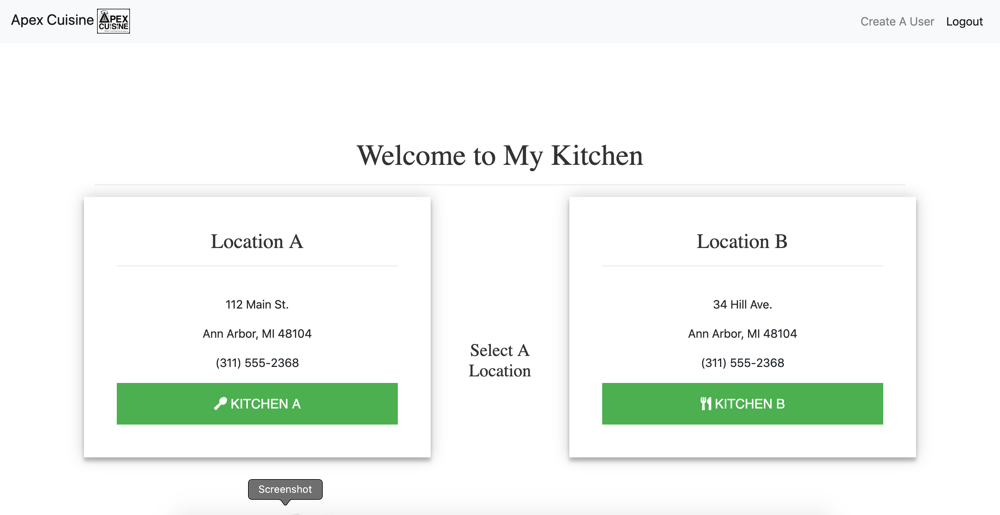
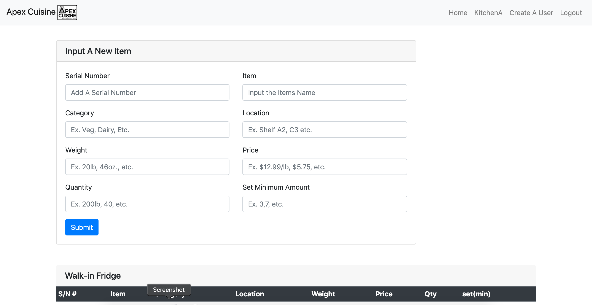
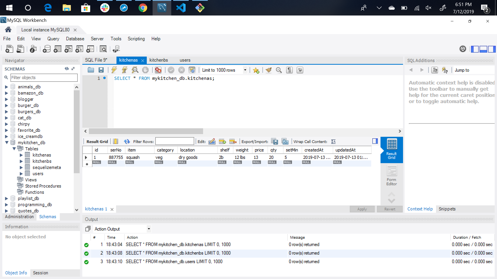

# MyKitchen
Project 2 - UCLA Extension  

Client: Apex Cuisine | Chef James Jilek 

The MyKitchen app is a basic inventory management system for catering companies and resturants. It can be used by the client to keep track of stock for multiple locations. The user can create new 'Locations' and create new 'prime storage locations' such as: Walk-in freezers, walk-in fridges, dry goods. Also, the user can input new items and edit all fields. The user can set a minimum amount of inventory for a specific item so when the item is <= to the set minimum, that row will be highlighted in 'red' and they'll recieve an email notification "Inventory low for (specific item)." 

Heroku deployed app link: https://serene-wave-45223.herokuapp.com/ and https://serene-wave-45223.herokuapp.com/kitchens

Issues: 
1.) GET and POST requests are not working. 
2.) Table data is not displaying.  
3.) Layouts for Kitchen A and Kitchen B are not finished. 

Log in page displays.

Create User page displays.

Main Kitchens Page

'Kitchen A' page ('Kitchen B' page is exactly the same layout and functionality)

Seeders in MySQL Workbench/Sequelize  

--------------------------------------

Tech Used: 

    1. Node.js
    2. Express.js 
    3. Passport 
    4. Sequelize 
    5. MySQL Workbench 
    6. Handlebars 
    7. Bootstrap 
    8. Heroku
    9. Node_Modules: express, path. 

Built With: 

    VS Code 

Authors: 

    Omar Alcala 
    Andrew Farag 
    Ryan Fogle 
    Vlad Neri 